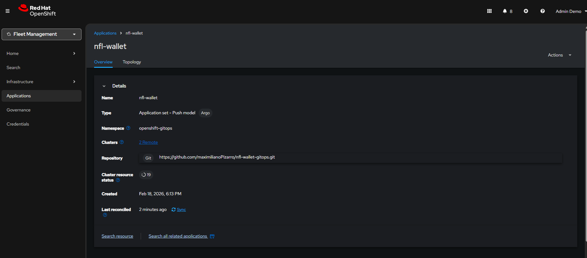
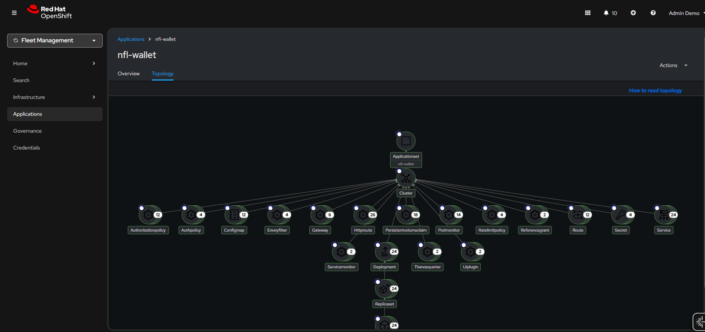

# Deploy with ACM and GitOps

This section describes the deployment of NFL Wallet using **Red Hat Advanced Cluster Management (ACM)** and **OpenShift GitOps** (Argo CD). The hub cluster runs ACM and Argo CD; managed clusters (east and west) receive applications via Placements and the ApplicationSet.

---

## Overview

- **Hub**: OpenShift with ACM and OpenShift GitOps. The ApplicationSet and Placements live in the `openshift-gitops` namespace.
- **Managed clusters**: Labeled with `region=east` or `region=west`, in the `global` cluster set. GitOpsCluster creates cluster secrets so Argo CD can deploy to them.
- **Result**: Six Applications (dev/test/prod × east/west) are created and synced from this repository.

For prerequisites and step-by-step commands, see [Getting started](getting-started.md#4b-deploy-with-acm).

---

## ACM console views

The following screenshots show the ACM topology and Applications once the deployment is in place.

### Topology and cluster status

*Figure 1: ACM topology view — hub and managed clusters (east, west). Green indicates clusters available and applications in sync; yellow can indicate OutOfSync or Progressing.*

### Applications and GitOps

*Figure 2: ACM Applications view — NFL Wallet ApplicationSet and the six generated Applications (dev/test/prod on east and west).*

### OpenShift GitOps (Argo CD)

*Figure 3: OpenShift GitOps — Argo CD Applications and sync status.*

---

## Quick reference

| Resource | Purpose |
|----------|---------|
| `app-nfl-wallet-acm.yaml` | ManagedClusterSetBinding, Placements, GitOpsCluster, ApplicationSet (apply on hub) |
| `ManagedClusterSetBinding` | Binds cluster set `global` to `openshift-gitops` so Placements can select clusters |
| `GitOpsCluster` | Registers managed clusters with Argo CD (creates cluster secrets east/west) |
| `Placement` (per env × region) | Selects which cluster receives each application (e.g. dev-east, test-west) |
| ApplicationSet `nfl-wallet` | List generator: one Application per (namespace × cluster) |

To refresh applications after changing the ApplicationSet: sync the ApplicationSet from the Argo CD UI or run `./scripts/force-sync-apps.sh` (see [Scripts README](../scripts/README.md)).
