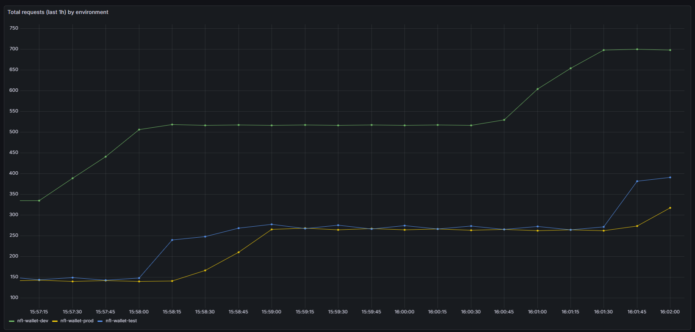
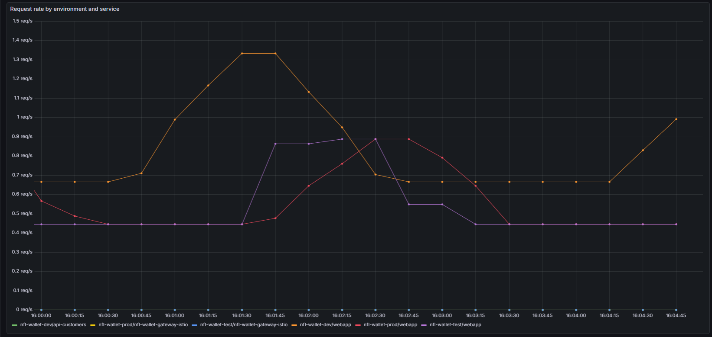

# Gateway policies (subscription and Blue/Green)

Gateway policies for **subscription / credential-based access** (Spec §6) and **Blue/Green** (Spec §12) are deployed with each app via Helm **templates** in the corresponding app folder. Argo CD syncs the app (e.g. `nfl-wallet-test` or `nfl-wallet-prod`) and the templates are rendered with the app’s namespace and labels.

## Where the manifests live

| App / namespace   | Templates | Contents |
|-------------------|-----------|----------|
| **nfl-wallet-dev**  | `nfl-wallet-dev/templates/` | `podmonitor-istio-gateway.yaml` (PodMonitor for Istio gateway metrics) |
| **nfl-wallet-test** | `nfl-wallet-test/templates/` | `auth-policy.yaml` (AuthPolicy), `reference-grant.yaml` (ReferenceGrant), `podmonitor-istio-gateway.yaml` (PodMonitor for Istio gateway metrics) |
| **nfl-wallet-prod** | `nfl-wallet-prod/templates/` | `auth-policy.yaml` (AuthPolicy), `bluegreen-httproute.yaml` (Blue/Green HTTPRoute), `canary-route.yaml` (OpenShift Route for canary host `nfl-wallet-canary.apps...`), `podmonitor-istio-gateway.yaml` (PodMonitor for Istio gateway metrics) |

No separate apply step is needed: when you deploy the test or prod Application (via ApplicationSet), Helm renders these templates into the app’s namespace with the correct labels.

## Labels on policy resources

Templates add standard labels so resources are tracked by GitOps and can be selected if needed:

- `app.kubernetes.io/name: nfl-wallet`
- `app.kubernetes.io/instance: {{ .Release.Name }}` (e.g. release name from Argo CD)
- `app.kubernetes.io/managed-by: {{ .Release.Service }}`
- `app.kubernetes.io/component`: `auth-policy`, `reference-grant`, or `bluegreen-route`
- `app.kubernetes.io/part-of: nfl-wallet`

## Subscription: limit dev access to test and prod

- **Goal:** Only consumers with valid API keys for test or prod can call those environments. Dev has no test/prod keys, so dev is denied access to test and prod APIs.
- **Mechanism:** AuthPolicy in test and prod namespaces requires API key authentication. The selector uses the **namespace** as the label value: `api: <Release.Namespace>` (e.g. `api: nfl-wallet-test`, `api: nfl-wallet-prod`). Clients must send the API key in the **`X-Api-Key`** header.

**Where API key Secrets are created:**  
Kuadrant expects API key Secrets in **`kuadrant-system`** when `allNamespaces` is `false`. This repo creates them in two ways:

1. **Helm templates (preferred):** When `nfl-wallet.apiKeys.enabled` is `true`, the charts **nfl-wallet-prod** and **nfl-wallet-test** include **`templates/api-key-secrets-kuadrant.yaml`**, which creates the 3 Secrets per env (customers, bills, raiders) in `kuadrant-system` using values from `nfl-wallet.apiKeys.*`. Syncing the app (e.g. via Argo CD) on each managed cluster creates the Secrets there; no manual apply needed. Optional values: `nfl-wallet.kuadrantNamespace` (default `kuadrant-system`), `nfl-wallet.authorinoManagedBy` (default `authorino`).

2. **Standalone manifest (fallback):** **`kuadrant-system/api-key-secrets.yaml`** defines all 6 Secrets for manual apply on clusters where the chart is not used or for one-off setup.

**Troubleshooting 401:** If test/prod return 401 with `X-Api-Key: nfl-wallet-customers-key`:

1. **If using the chart:** Ensure the app has synced (Argo CD or `helm upgrade`) so the templates have created the Secrets in `kuadrant-system`. Check: `kubectl get secrets -n kuadrant-system -l 'api in (nfl-wallet-test, nfl-wallet-prod)'`
2. **Otherwise:** Apply manually: `kubectl apply -f kuadrant-system/api-key-secrets.yaml`
3. If Authorino CR name is not `authorino`, set `nfl-wallet.authorinoManagedBy` in helm-values or edit the label in the standalone manifest.

## Blue/Green with test and prod namespaces

- **Goal:** One hostname that splits traffic by weight between the test (blue) and prod (green) namespaces.
- **Mechanism:** The HTTPRoute in `nfl-wallet-prod/templates/bluegreen-httproute.yaml` is **only created when `nfl-wallet.blueGreen.enabled` is `true`** in `nfl-wallet-prod/helm-values.yaml`. By default it is `false` so the route is not applied until the target Gateway exists and allows routes from the prod namespace. When enabled, the route has two backendRefs (prod and test) with weights (default 90/10). The ReferenceGrant in `nfl-wallet-test/templates/reference-grant.yaml` allows the prod HTTPRoute to reference the Service in the test namespace.

*Figure: Blue/Green canary hostname — traffic split between prod and test.*

*Figure: Blue/Green — weight-based routing (e.g. 90% prod, 10% test).*

**Is the rule between gateways (test and prod) applied?**  
Yes. When `nfl-wallet.blueGreen.enabled` is `true` and you sync the **nfl-wallet-prod** and **nfl-wallet-test** applications, two things are applied: (1) the **HTTPRoute** `nfl-wallet-bluegreen` in `nfl-wallet-prod` (parent: prod Gateway; hostname: canary; backendRefs: prod Service 90%, test Service 10%), and (2) the **ReferenceGrant** in `nfl-wallet-test` that allows that HTTPRoute to reference the Service in the test namespace. No extra apply step is needed; both are Helm templates in this repo.

**Do you need to externalize the gateway for the canary host?**  
Yes. The Blue/Green HTTPRoute is attached to the **prod** Gateway and matches the **canary hostname** (e.g. `nfl-wallet-canary.apps.<cluster-domain>`). This repo creates that external entry point: when `nfl-wallet.blueGreen.enabled` is `true`, the template **`canary-route.yaml`** creates an OpenShift **Route** named `nfl-wallet-canary` with host `nfl-wallet.blueGreen.hostname`, forwarding to the same Gateway Service (`nfl-wallet-gateway-istio`). Traffic to `nfl-wallet-canary.apps...` thus reaches the prod Gateway and the HTTPRoute splits it to prod and test backends. No manual Route is required.

Enable Blue/Green only after confirming the Gateway exists (`kubectl get gateway -n nfl-wallet-prod`) and that it accepts routes from that namespace. Then set `blueGreen.enabled: true` in prod helm-values. Use a **dedicated hostname** for the canary route (e.g. `nfl-wallet-canary.apps.<cluster-domain>`) in `blueGreen.hostname`; do not use the same hostname as the main prod route (`nfl-wallet-prod.apps...`), or the blue/green HTTPRoute will override it and can cause 500. Ensure that host has a Route or DNS so traffic reaches the gateway.

### Gateway "address pending" and app stuck in Progressing

When Blue/Green is enabled, the prod HTTPRoute references the Service `nfl-wallet-gateway-istio` in **nfl-wallet-test**. The Gateway (e.g. in prod namespace) can then report status like: *"Assigned to service(s) nfl-wallet-gateway-istio.nfl-wallet-test.svc.cluster.local:8080, but failed to assign to all requested addresses: address pending for hostname ..."*. Argo CD may treat that Gateway as not healthy and leave the **Application** in **Progressing** indefinitely.

- **Cause:** The Gateway controller is waiting for the cross-namespace backend (test) to be ready. On clusters where `nfl-wallet-test` is not yet deployed or the Service has no endpoints, the address stays pending.
- **What we do in this repo:** The ApplicationSet already has **ignoreDifferences** for `Gateway` `.status` so the live status does not cause sync diff. To avoid the app staying Progressing you can:
  1. **Recommended:** Deploy and sync **nfl-wallet-test** on that cluster first so `nfl-wallet-gateway-istio` in `nfl-wallet-test` exists and has endpoints; the Gateway status will then clear and the app can become Healthy.
  2. If the **Gateway** resource is defined in another repo/chart, add `argocd.argoproj.io/ignore-healthcheck: "true"` to that Gateway so Argo does not block app health on its status.
  3. Alternatively, in Argo CD (e.g. ConfigMap `argocd-cm` or resource customizations) add a custom health check for `gateway.networking.k8s.io/Gateway` that treats this "address pending" state as Healthy or Degraded instead of Progressing.

## Customization

- **Gateway name:** The AuthPolicy and Blue/Green HTTPRoute target the Gateway by name. This is configurable via **`nfl-wallet.gatewayPolicyGatewayName`** in `helm-values.yaml` (test and prod). Default in the template is `nfl-wallet-gateway-istio`; if your chart creates a Gateway with another name (e.g. `gateway`), set `gatewayPolicyGatewayName: "gateway"`. To see the actual name: `kubectl get gateway -n nfl-wallet-test` (or `nfl-wallet-prod`).
- **Blue/Green hostname/weights:** Edit `nfl-wallet-prod/templates/bluegreen-httproute.yaml` (hostnames, backendRefs[].weight).
- **API key label key:** If you use a label key other than `api`, update the AuthPolicy `selector.matchLabels` in the templates to match your Secrets.
