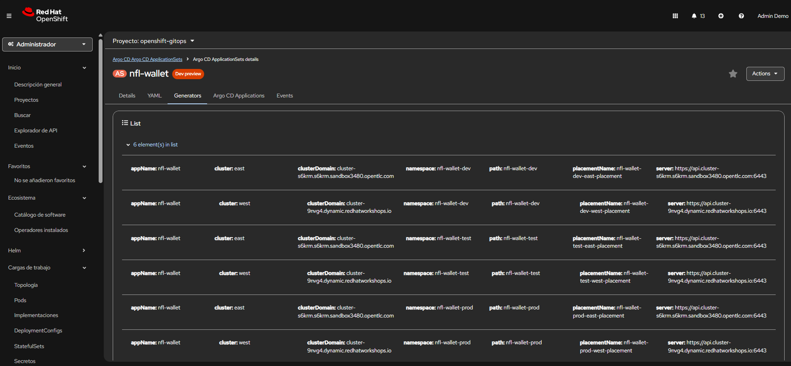

# NFL Wallet GitOps

**GitOps for NFL Stadium Wallet on OpenShift** — Argo CD and optional Red Hat Advanced Cluster Management (ACM) for east/west multi-cluster deployment.

---

## Purpose

This repository provides:

* **Declarative deployment** of the [NFL Stadium Wallet](https://maximilianopizarro.github.io/NFL-Wallet/) stack (Vue webapp + Customers, Bills, and Raiders APIs) via Git and Argo CD.
* **Multi-cluster options**: with **ACM**, one ApplicationSet and Placements drive six Applications (dev/test/prod × east/west); without ACM, separate ApplicationSets for east and west.
* **Gateway and security**: HTTPRoutes, Kuadrant AuthPolicy and RateLimitPolicy, and optional Blue/Green (prod) as defined in the [NFL Stadium Wallet — Connectivity Link](https://maximilianopizarro.github.io/NFL-Wallet/connectivity-link) and [Security](https://maximilianopizarro.github.io/NFL-Wallet/security) sections.

The Helm chart used is [nfl-wallet on Artifact Hub](https://artifacthub.io/packages/helm/nfl-wallet/nfl-wallet); values and overlay templates live in `nfl-wallet-dev/`, `nfl-wallet-test/`, and `nfl-wallet-prod/`.

---

## OpenShift GitOps



*OpenShift GitOps (Argo CD) — Applications and sync status. See [Deploy with ACM and GitOps](deploy-acm-gitops.md) for more screenshots.*

---

## What you can do

| Option | Description |
|--------|-------------|
| **Deploy with ACM and GitOps** | Apply `app-nfl-wallet-acm.yaml` on the hub; Placements and ApplicationSet create six Applications and sync to east/west. See [Deploy with ACM and GitOps](deploy-acm-gitops.md) and [Getting started — 4b](getting-started.md#4b-deploy-with-acm). |
| **Deploy without ACM** | Use `app-nfl-wallet-east.yaml` and `app-nfl-wallet-west.yaml`; no cluster set or Placements required. See [Getting started — 4a](getting-started.md#4a-deploy-with-eastwest-no-acm). |
| **API reference** | Customers, Bills, and Raiders APIs — hosts, paths, and API keys per environment. See [API](api.md); full chart and Connectivity Link docs: [NFL Stadium Wallet](https://maximilianopizarro.github.io/NFL-Wallet/). |
| **Gateway policies** | AuthPolicy (API key), RateLimitPolicy, and Blue/Green HTTPRoute — where templates live and how to customize. See [Gateway policies](gateway-policies.md). |
| **Observability** | Grafana Operator YAMLs, test scripts, and dashboard for dev/test/prod. See [Observability](observability.md). |

---

## Quick links

* [**Architecture**](architecture.md) — Placements, ApplicationSets, multi-cluster (ACM and standalone).
* [**Getting started**](getting-started.md) — Prerequisites, Helm deps, deploy steps (east/west and ACM).
* [**Deploy with ACM and GitOps**](deploy-acm-gitops.md) — ACM topology and Applications (screenshots).
* [**API**](api.md) — API endpoints and hosts; links to [NFL Stadium Wallet](https://maximilianopizarro.github.io/NFL-Wallet/) (Jekyll) for Deployment, Connectivity Link, Security.
* [**Gateway policies**](gateway-policies.md) — AuthPolicy, RateLimitPolicy, Blue/Green.
* [**Observability**](observability.md) — Metrics, Grafana, test scripts.
* [**NFL Stadium Wallet (chart docs)**](https://maximilianopizarro.github.io/NFL-Wallet/) — Jekyll site: Architecture, Deployment, Connectivity Link, Security, Observability.
* [**Repository README**](https://github.com/maximilianoPizarro/nfl-wallet-gitops/blob/main/README.md)

---

## Environments and namespaces

| Environment | Namespace        |
|-------------|------------------|
| Dev         | `nfl-wallet-dev` |
| Test        | `nfl-wallet-test`|
| Prod        | `nfl-wallet-prod`|

---

## Repository structure

```
.
├── app-nfl-wallet-acm.yaml       # ACM Placements + ApplicationSet (when using ACM)
├── app-nfl-wallet-east.yaml      # ApplicationSet for east cluster (no ACM)
├── app-nfl-wallet-west.yaml      # ApplicationSet for west cluster (no ACM)
├── kuadrant.yaml                 # Kuadrant CR (RateLimitPolicy / AuthPolicy)
├── nfl-wallet-dev/               # Helm values + optional templates
├── nfl-wallet-test/              # Helm values + templates (AuthPolicy, ReferenceGrant)
├── nfl-wallet-prod/              # Helm values + templates (AuthPolicy, Blue/Green HTTPRoute)
├── docs/                         # This documentation (MkDocs / GitHub Pages)
└── scripts/                      # update-helm-deps, force-sync-apps, test-apis, etc.
```
