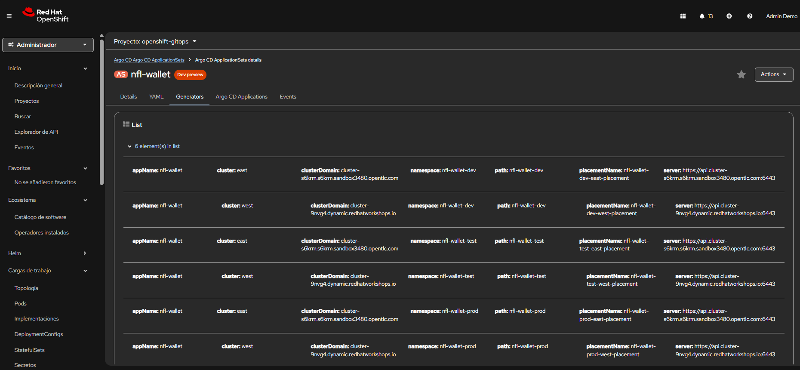

# NFL Wallet GitOps

**GitOps for NFL Stadium Wallet on OpenShift** — Argo CD and optional Red Hat Advanced Cluster Management (ACM) for east/west multi-cluster deployment.

---

## Purpose

This repository provides:

* **Declarative deployment** of the [NFL Stadium Wallet](https://maximilianopizarro.github.io/NFL-Wallet/) stack (Vue webapp + Customers, Bills, Raiders APIs) via Git and Argo CD.
* **Multi-cluster options**: with **ACM**, one ApplicationSet and Placements generate six Applications (dev/test/prod × east/west); without ACM, separate ApplicationSets for east and west.
* **Gateway and security**: Routes, Kuadrant AuthPolicy and RateLimitPolicy, defined in Kustomize overlays.

Deployment uses **Kustomize** (not Helm). Overlays in `nfl-wallet/` deploy Routes, AuthPolicy, API keys, and namespace-mesh. The application (Gateway, webapp, backends) is deployed separately with the [nfl-wallet chart](https://artifacthub.io/packages/helm/nfl-wallet/nfl-wallet).

---


---

## OpenShift GitOps



*OpenShift GitOps (Argo CD) — Applications and sync status. See [Deploy with ACM](deploy-acm-gitops.md).*

---

## Available options

| Option | Description |
|--------|-------------|
| **Deploy with ACM** | Apply `app-nfl-wallet-acm.yaml` + `app-nfl-wallet-acm-cluster-decision.yaml` on the hub; GitOpsCluster and ApplicationSet create six Applications. See [ARGO-ACM-DEPLOY](ARGO-ACM-DEPLOY.md) and [Getting started — 4b](getting-started.md#4b-deploy-with-acm). |
| **Deploy without ACM** | Use `app-nfl-wallet-east.yaml` and `app-nfl-wallet-west.yaml`; no cluster set or Placements required. See [Getting started — 4a](getting-started.md#4a-deploy-with-eastwest-no-acm). |
| **API Reference** | Customers, Bills, Raiders APIs — hosts, paths, and API keys per environment. See [API](api.md). |
| **Gateway Policies** | AuthPolicy (API key), RateLimitPolicy — location in Kustomize overlays. See [Gateway policies](gateway-policies.md). |
| **Observability** | Grafana Operator, ServiceMonitors, test scripts. See [Observability](observability.md). |

---

## Quick links

* [**Architecture**](architecture.md) — Placements, ApplicationSets, multi-cluster (ACM and standalone).
* [**Getting started**](getting-started.md) — Prerequisites and deployment steps (east/west and ACM).
* [**ARGO-ACM-DEPLOY**](ARGO-ACM-DEPLOY.md) — ACM logic and application order.
* [**Deploy with ACM**](deploy-acm-gitops.md) — ACM topology and Applications (screenshots).
* [**API**](api.md) — Endpoints and hosts.
* [**Gateway policies**](gateway-policies.md) — AuthPolicy, RateLimitPolicy.
* [**Observability**](observability.md) — Metrics, Grafana, test scripts.
* [**NFL Stadium Wallet (chart)**](https://maximilianopizarro.github.io/NFL-Wallet/) — Chart documentation.
* [**Repository README**](https://github.com/maximilianoPizarro/nfl-wallet-gitops/blob/main/README.md)

---

## Environments and namespaces

| Environment | Namespace        |
|-------------|------------------|
| Dev         | `nfl-wallet-dev` |
| Test        | `nfl-wallet-test`|
| Prod        | `nfl-wallet-prod`|

---

## Repository structure

```
.
├── app-nfl-wallet-acm.yaml              # Placements + GitOpsCluster (ACM)
├── app-nfl-wallet-acm-cluster-decision.yaml  # ApplicationSet (list generator)
├── app-nfl-wallet-east.yaml             # ApplicationSet east (no ACM)
├── app-nfl-wallet-west.yaml             # ApplicationSet west (no ACM)
├── argocd-placement-configmap.yaml      # ConfigMap acm-placement
├── argocd-applicationset-rbac-placement.yaml
├── kuadrant.yaml                        # Kuadrant CR
├── nfl-wallet/                          # Kustomize (routes, AuthPolicy, API keys)
│   ├── base/                            # gateway route
│   ├── base-canary/                     # canary route (prod)
│   └── overlays/                        # dev, test, prod + dev-east, dev-west, etc.
├── nfl-wallet-observability/            # Grafana + ServiceMonitors
├── observability/                       # Grafana Operator base
├── docs/                                # This documentation
└── scripts/                             # force-sync-apps, test-apis, etc.
```
