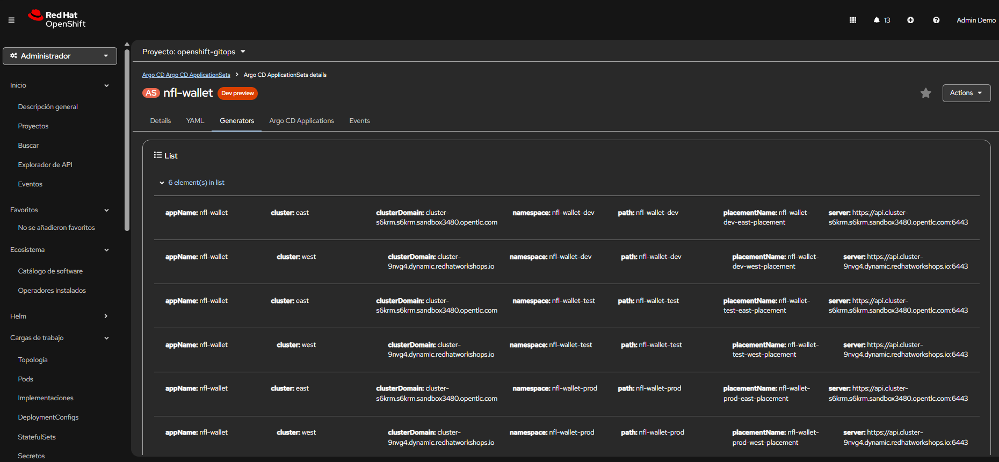

# Stadium Wallet GitOps

**GitOps for Stadium Wallet on OpenShift** — Argo CD and optional Red Hat Advanced Cluster Management (ACM) for east/west multi-cluster deployment.

---

## Purpose

This repository provides:

* **Declarative deployment** of the [Stadium Wallet](https://maximilianopizarro.github.io/NFL-Wallet/) stack (Vue webapp + Customers, Bills, Raiders APIs) via Git and Argo CD.
* **Multi-cluster options**: with **ACM**, one ApplicationSet and Placements generate six Applications (dev/test/prod × east/west); without ACM, separate ApplicationSets for east and west.
* **Gateway and security**: Routes, Kuadrant AuthPolicy and RateLimitPolicy, defined in Kustomize overlays.

Deployment uses **Kustomize** (not Helm). Overlays in `nfl-wallet/` deploy Routes, AuthPolicy, API keys, and namespace-mesh. The application (Gateway, webapp, backends) is deployed separately with the [Stadium Wallet chart](https://artifacthub.io/packages/helm/nfl-wallet/nfl-wallet).

---


---

## OpenShift GitOps



*OpenShift GitOps (Argo CD) — Applications and sync status. See [Deploy with ACM](deploy-acm-gitops.md).*

---

## Available options

| Option | Description |
|--------|-------------|
| **Deploy with ACM** | Apply `app-nfl-wallet-acm.yaml` + `app-nfl-wallet-acm-cluster-decision.yaml` + `app-kuadrant-resources.yaml` on the hub; GitOpsCluster and ApplicationSet create six Applications + two kuadrant-resources Applications. See [ARGO-ACM-DEPLOY](ARGO-ACM-DEPLOY.md) and [Getting started — 4b](getting-started.md#4b-deploy-with-acm). |
| **Deploy without ACM** | Use `app-nfl-wallet-east.yaml` and `app-nfl-wallet-west.yaml`; no cluster set or Placements required. See [Getting started — 4a](getting-started.md#4a-deploy-with-eastwest-no-acm). |
| **Biometric Login** | RHBK + NeuroFace biometric authentication (chart 0.1.3) in dev and test. FHD camera (1920×1080). See [Gateway policies](gateway-policies.md#rhbk-biometric-login-dev--test--chart-013). |
| **OIDC Policy** | JWT validation for wallet APIs in test via chart OIDC policy objects. See [Gateway policies](gateway-policies.md#oidc-policy-test-only--chart-013). |
| **API Reference** | Customers, Bills, Raiders APIs — hosts, paths, and API keys per environment. See [API](api.md). |
| **Gateway Policies** | AuthPolicy (API key), RateLimitPolicy, OIDC policy — location in Kustomize overlays and chart. See [Gateway policies](gateway-policies.md). |
| **Observability** | Grafana Operator, ServiceMonitors, test scripts. See [Observability](observability.md). |
| **QA Test Plan** | Automated end-to-end tests (10 cases). Run `qa-test-plan.sh` authenticated to the hub with east/west env vars. See [QA Test Plan](qa-test-plan.md). |
| **Canary (prod)** | Test chart 0.1.3 with biometric login via canary URLs before promoting to prod. See [Gateway policies](gateway-policies.md#testing-013-via-canary). |

---

## Quick links

* [**Architecture**](architecture.md) — Placements, ApplicationSets, multi-cluster (ACM and standalone).
* [**Getting started**](getting-started.md) — Prerequisites and deployment steps (east/west and ACM).
* [**ARGO-ACM-DEPLOY**](ARGO-ACM-DEPLOY.md) — ACM logic and application order.
* [**Deploy with ACM**](deploy-acm-gitops.md) — ACM topology and Applications (screenshots).
* [**API**](api.md) — Endpoints and hosts.
* [**Gateway policies**](gateway-policies.md) — AuthPolicy, RateLimitPolicy.
* [**Observability**](observability.md) — Metrics, Grafana, test scripts.
* [**QA Test Plan**](qa-test-plan.md) — Automated end-to-end test suite (`qa-test-plan.sh`): GitOps sync, mesh, auth, rate limiting, cross-cluster, observability.
* [**Stadium Wallet (chart)**](https://maximilianopizarro.github.io/NFL-Wallet/) — Chart documentation.
* [**Repository README**](https://github.com/maximilianoPizarro/nfl-wallet-gitops/blob/main/README.md)

---

## Environments and namespaces

| Environment | Namespace        | Chart version | Biometric login | OIDC policy |
|-------------|------------------|---------------|-----------------|-------------|
| Dev         | `nfl-wallet-dev` | **0.1.3** | RHBK + NeuroFace (FHD) | Disabled |
| Test        | `nfl-wallet-test`| **0.1.3** | RHBK + NeuroFace (FHD) | Enabled |
| Prod        | `nfl-wallet-prod`| **0.1.1** | — | — |

---

## Repository structure

```
.
├── app-nfl-wallet-acm.yaml              # Placements + GitOpsCluster (ACM)
├── app-nfl-wallet-acm-cluster-decision.yaml  # ApplicationSet (list generator)
├── app-kuadrant-resources.yaml          # Kuadrant resource patches (east + west)
├── app-nfl-wallet-east.yaml             # ApplicationSet east (no ACM)
├── app-nfl-wallet-west.yaml             # ApplicationSet west (no ACM)
├── argocd-placement-configmap.yaml      # ConfigMap acm-placement
├── argocd-applicationset-rbac-placement.yaml
├── kuadrant.yaml                        # Kuadrant CR
├── kuadrant-system/                     # Authorino, Limitador, Gateway resources
├── nfl-wallet/                          # Kustomize (routes, AuthPolicy, API keys)
│   ├── base/                            # gateway route
│   ├── base-canary/                     # canary route (prod)
│   └── overlays/                        # dev, test, prod + dev-east, dev-west, etc.
├── nfl-wallet-observability/            # Grafana + ServiceMonitors
├── observability/                       # Grafana Operator base
├── docs/                                # This documentation
└── scripts/                             # force-sync-apps, test-apis, etc.
```
