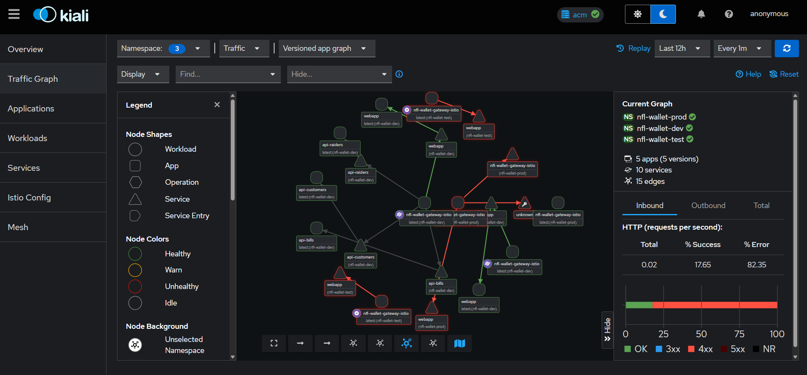
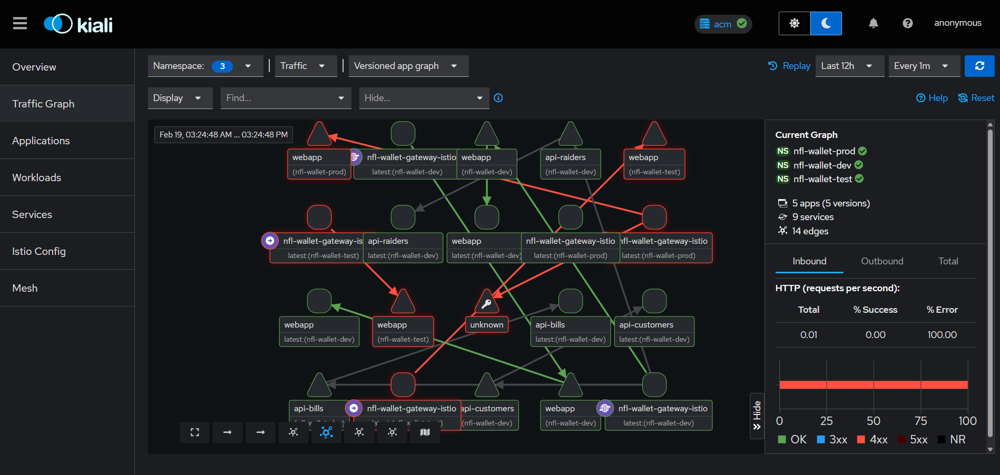
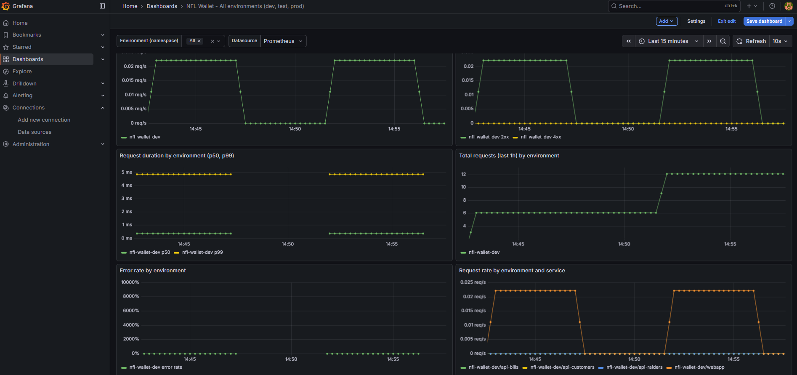

# Observability

This page describes how to observe NFL Wallet traffic across **dev**, **test**, and **prod**: run API tests via a **bash script** (including wildcard URL), provision **Grafana** with the **Grafana Operator** YAMLs, and view traffic in **Kiali**. 

---

## 1. Bash script: run API tests

The script **`observability/run-tests.sh`** runs `curl` against dev, test, and prod APIs so that traffic appears in Kiali and Grafana.

The gateway route host in each environment uses the pattern **`nfl-wallet-<env>.apps.<cluster-domain>`** (e.g. prod: `nfl-wallet-prod.apps.cluster-lzdjz.lzdjz.sandbox1796.opentlc.com`). The script uses this same pattern by default.

### Option 1: CLUSTER_DOMAIN (recommended)

Set **`CLUSTER_DOMAIN`** to your OpenShift apps domain; the script builds `https://nfl-wallet-ENV.apps.<cluster-domain>`:

```bash
export CLUSTER_DOMAIN="cluster-lzdjz.lzdjz.sandbox1796.opentlc.com"
export API_KEY_TEST="<value from nfl-wallet-test apiKeys>"
export API_KEY_PROD="<value from nfl-wallet-prod apiKeys>"
./observability/run-tests.sh all
```

### Option 2: WILDCARD_URL

Set **`WILDCARD_URL`** with placeholder **`ENV`** (replaced by `dev`, `test`, or `prod`):

```bash
export WILDCARD_URL="https://nfl-wallet-ENV.apps.cluster-lzdjz.lzdjz.sandbox1796.opentlc.com"
export API_KEY_TEST="<value from nfl-wallet-test apiKeys.customers | bills | raiders>"
export API_KEY_PROD="<value from nfl-wallet-prod apiKeys.customers | bills | raiders>"
./observability/run-tests.sh all
```

### Option 3: Explicit hosts

Set each host and scheme explicitly (same pattern as the gateway route):

```bash
export DEV_HOST="nfl-wallet-dev.apps.cluster-lzdjz.lzdjz.sandbox1796.opentlc.com"
export TEST_HOST="nfl-wallet-test.apps.cluster-lzdjz.lzdjz.sandbox1796.opentlc.com"
export PROD_HOST="nfl-wallet-prod.apps.cluster-lzdjz.lzdjz.sandbox1796.opentlc.com"
export SCHEME="https"
export API_KEY_TEST="<value from nfl-wallet-test apiKeys>"
export API_KEY_PROD="<value from nfl-wallet-prod apiKeys>"
./observability/run-tests.sh all
```

**Defaults:** With no env vars set, the script uses `nfl-wallet-{dev|test|prod}.apps.cluster-lzdjz...`, `SCHEME=https`, and API key **`nfl-wallet-customers-key`** for test/prod (same as helm-values default for testing).

**When opening the URL in a browser:** **Prod** returns **401** (auth required; browser does not send the API key). **Test** may return **404** on `/` because the route typically exposes only `/api/*`, not the root. To verify: use the script or call `/api/customers` with the header: `curl -H "X-Api-Key: nfl-wallet-customers-key" "https://nfl-wallet-prod.apps..../api/customers"`.

### Script usage

| Command | Description |
|--------|-------------|
| `./observability/run-tests.sh all` | Run dev, test, and prod (default). |
| `./observability/run-tests.sh dev` | Dev only (no API key). |
| `./observability/run-tests.sh test` | Test only (default key: `nfl-wallet-customers-key`). |
| `./observability/run-tests.sh prod` | Prod only (default key: `nfl-wallet-customers-key`). |
| `./observability/run-tests.sh loop` | Send 20 requests per API to generate sustained traffic for Kiali/Grafana. |

**Environment variables:** `CLUSTER_DOMAIN`, `WILDCARD_URL`, `DEV_HOST`, `TEST_HOST`, `PROD_HOST`, `API_KEY_TEST`, `API_KEY_PROD`, `SCHEME` (default `https`), `API_PATH` (default `/api`), `LOOP_COUNT` (default `20`).

---

## 2. Grafana Operator (YAMLs)

The **`observability/grafana-operator/`** directory contains YAML manifests to use with the [Grafana Operator](https://grafana.github.io/grafana-operator/) so you can visualize NFL Wallet traffic in Grafana without manual import.

### Contents

| File | Description |
|------|-------------|
| `namespace.yaml` | Namespace `observability` (optional; you can use your own Grafana namespace). |
| `grafana-instance.yaml` | **Grafana** CR – deploys a Grafana instance with label `dashboards: nfl-wallet`. Omit if you already have Grafana; then add this label or adjust `instanceSelector` in the datasource and dashboard. |
| `grafana-datasource-prometheus.yaml` | **GrafanaDatasource** – Prometheus for Istio/mesh metrics. **Edit `spec.datasource.url`** to your Prometheus URL (e.g. `http://prometheus-operated.monitoring.svc.cluster.local:9090`). |
| `grafana-dashboard-configmap.yaml` | **ConfigMap** – JSON for the “NFL Wallet – All environments” dashboard. |
| `grafana-dashboard-nfl-wallet.yaml` | **GrafanaDashboard** CR – provisions the dashboard into Grafana. |

### Apply order

1. Create the namespace (or use an existing one):  
   `kubectl apply -f observability/grafana-operator/namespace.yaml`
2. (Optional) Deploy the Grafana instance:  
   `kubectl apply -f observability/grafana-operator/grafana-instance.yaml`
3. Edit the Prometheus URL in `grafana-datasource-prometheus.yaml`, then:  
   `kubectl apply -f observability/grafana-operator/grafana-datasource-prometheus.yaml`
4. Apply the dashboard ConfigMap and CR:  
   `kubectl apply -f observability/grafana-operator/grafana-dashboard-configmap.yaml`  
   `kubectl apply -f observability/grafana-operator/grafana-dashboard-nfl-wallet.yaml`

Or apply the whole directory after editing the Prometheus URL:  
`kubectl apply -f observability/grafana-operator/`

### Cómo armar el tablero Grafana (paso a paso)

Con las apps desplegadas en **east** y **west**, podés tener un Grafana por clúster (east y west) o uno central que consulte un Thanos que agregue ambos. Pasos típicos para **un clúster** (por ejemplo east):

1. **Grafana Operator instalado** en el clúster donde quieras Grafana (east, west o hub). Si usás OpenShift, podés instalar el [Grafana Operator](https://grafana.github.io/grafana-operator/) desde OperatorHub.

2. **Namespace y instancia Grafana** (desde la raíz del repo):
   ```bash
   kubectl apply -f observability/grafana-operator/namespace.yaml
   kubectl apply -f observability/grafana-operator/grafana-instance.yaml
   ```
   Si ya tenés una instancia Grafana, omití `grafana-instance.yaml` y asegurate de que tenga la etiqueta `dashboards: nfl-wallet` (o cambiá `instanceSelector` en datasource y dashboard).

3. **URL de Prometheus/Thanos:** El dashboard usa métricas Istio (`istio_requests_total`, etc.). Esa fuente debe ser un Prometheus (o Thanos) que **raspe el service mesh de ese clúster** (gateway y pods en `nfl-wallet-dev`, `nfl-wallet-test`, `nfl-wallet-prod`).
   - Descubrí el servicio:
     ```bash
     kubectl get svc -A | grep -E 'prometheus|thanos'
     ```
   - URLs habituales (solo **dentro del clúster**, no la Route `.apps.`):
     - Prometheus User Workload (OpenShift):  
       `http://prometheus-user-workload.openshift-user-workload-monitoring.svc.cluster.local:9091`
     - Thanos Querier (OpenShift Cluster Observability):  
       `http://thanos-querier.openshift-monitoring.svc.cluster.local:9091`  
       (o el Thanos de tu namespace de observability, ej. `...openshift-cluster-observability-operator.svc.cluster.local:10902`)
   - Editá `observability/grafana-operator/grafana-datasource-prometheus.yaml` y poné esa URL en `spec.datasource.url`.

4. **Datasource y dashboard:**
   ```bash
   kubectl apply -f observability/grafana-operator/grafana-datasource-prometheus.yaml
   kubectl apply -f observability/grafana-operator/grafana-dashboard-configmap.yaml
   kubectl apply -f observability/grafana-operator/grafana-dashboard-nfl-wallet.yaml
   ```

5. **Acceso a Grafana:** Con `route.enabled: true` en la instancia, el operator crea una Route. Ver la URL:
   ```bash
   oc get route -n observability
   ```
   Usuario **admin**; contraseña en el Secret:
   ```bash
   kubectl get secret -n observability -l app.kubernetes.io/name=grafana -o name
   kubectl get secret <nombre-del-secret> -n observability -o jsonpath='{.data.admin-password}' | base64 -d
   ```
   En la UI: **Dashboards** → **NFL Wallet – All environments**. Filtrá por **Environment (namespace)** (nfl-wallet-dev, nfl-wallet-test, nfl-wallet-prod).

6. **Que haya datos:** Prometheus tiene que estar raspando el gateway Istio (PodMonitors en este repo en cada namespace nfl-wallet-*). Generá tráfico con `./scripts/test-apis.sh` o `./observability/run-tests.sh all` y refrescá el dashboard; el rango de tiempo debe incluir ese período.

**East y West por separado:** Para ver métricas de **east** y **west** en un solo lugar, el datasource tiene que apuntar a un Thanos (o Prometheus) que agregue ambos clústers (p. ej. OpenShift Cluster Observability con recolección multi-cluster). En ese caso usá la URL de ese Thanos en el datasource; si las métricas tienen etiqueta de clúster, podés agregar una variable "Cluster" en el dashboard más adelante.

### Dashboard panels

The provisioned dashboard includes:

- **Environment (namespace)** variable to filter by `nfl-wallet-dev`, `nfl-wallet-test`, `nfl-wallet-prod`, or view all.
- Request rate by environment.
- Response codes (2xx, 4xx, 5xx) by environment.
- Request duration (p50, p99) by environment.
- Total requests (last 1h) and error rate by environment.
- Request rate by environment and service.

Prometheus must scrape Istio/Envoy metrics (e.g. from the gateway). The dashboard uses `istio_requests_total` and `istio_request_duration_milliseconds_bucket`.

---

## 3. Manual curl examples

If you prefer to run curl by hand, use the gateway host pattern **`nfl-wallet-<env>.apps.<cluster-domain>`** (e.g. `nfl-wallet-prod.apps.cluster-lzdjz.lzdjz.sandbox1796.opentlc.com`) with `https://`.

### Dev (no authentication)

```bash
export GATEWAY_HOST="nfl-wallet-dev.apps.cluster-lzdjz.lzdjz.sandbox1796.opentlc.com"
curl -s -w "\nHTTP_CODE:%{http_code}\n" "https://${GATEWAY_HOST}/api/customers"
curl -s -w "\nHTTP_CODE:%{http_code}\n" "https://${GATEWAY_HOST}/api/bills"
curl -s -w "\nHTTP_CODE:%{http_code}\n" "https://${GATEWAY_HOST}/api/raiders"
```

### Test and prod (API key required)

Use the same API key as in the Helm chart (`nfl-wallet.apiKeys.customers`, `.bills`, or `.raiders` in the corresponding env’s `helm-values.yaml` or the Secret that backs them).

```bash
export GATEWAY_HOST="nfl-wallet-test.apps.cluster-lzdjz.lzdjz.sandbox1796.opentlc.com"
export API_KEY="<value from nfl-wallet-test apiKeys.customers | bills | raiders>"
curl -s -w "\nHTTP_CODE:%{http_code}\n" -H "X-Api-Key: ${API_KEY}" "https://${GATEWAY_HOST}/api/customers"
# Same for bills and raiders; for prod use nfl-wallet-prod.apps.<cluster-domain> and prod apiKeys value.
```

If your HTTPRoutes use different paths (e.g. `/customers` instead of `/api/customers`), set `API_PATH` in the script or adjust the URLs above.

---

## 4. Viewing traffic in Kiali

- Traffic that goes through the **Istio gateway** into the mesh is visible in **Kiali** (service graph, traffic by namespace/workload, response codes, latency).
- Use the **Application** or **Namespace** view and select `nfl-wallet-dev`, `nfl-wallet-test`, or `nfl-wallet-prod`.
- Run the bash script or curl examples with the correct host so requests hit the gateway, then refresh Kiali to see the new traffic.

### Service mesh screenshots


*Figure: Kiali service graph — traffic through the Istio gateway (nfl-wallet-dev/test/prod).*



*Figure: Kiali Traffic Graph — topology of webapp, gateway, and APIs (customers, bills, raiders) across nfl-wallet-dev, nfl-wallet-test, and nfl-wallet-prod.*



*Figure: Grafana dashboard — request rate, response codes, and latency by environment (Istio metrics).*



*Figure: Grafana “NFL Wallet – All environments” dashboard with Environment variable (dev, test, prod).*

---

## 4.1 Making traffic visible in the service mesh (Kiali and Grafana)

For traffic to appear in **Kiali** and in the **Grafana** dashboard (metrics like `istio_requests_total`), three things must be true:

1. **Traffic goes through the gateway**  
   Send requests to the gateway host (e.g. `https://nfl-wallet-dev.apps.<cluster-domain>/api/customers`), not directly to a Service URL inside the cluster. Use **`observability/run-tests.sh`** or the curl examples in this doc; they already target the gateway.

2. **Workloads are in the mesh**  
   The namespaces `nfl-wallet-dev`, `nfl-wallet-test`, and `nfl-wallet-prod` must be part of the Istio mesh (sidecar injection or ambient). The Gateway and HTTPRoutes are created by the Helm chart; ensure the mesh is installed and those namespaces are configured for injection if required.

3. **Prometheus scrapes Istio/Envoy metrics**  
   The Prometheus that Grafana uses (or that feeds your Thanos) must scrape the Istio proxy metrics from the gateway (and optionally from the API pods).  
   - **This repo includes a PodMonitor per environment:** `nfl-wallet-dev/templates/podmonitor-istio-gateway.yaml`, `nfl-wallet-test/templates/podmonitor-istio-gateway.yaml`, `nfl-wallet-prod/templates/podmonitor-istio-gateway.yaml`. They select pods with label `app: nfl-wallet-gateway-istio` and scrape port `status-port` (15020), path `/stats/prometheus`. When you deploy or sync each app (dev, test, prod), the PodMonitor is created in that namespace.  
   - **Prometheus must discover these PodMonitors:** The Prometheus instance that feeds your Grafana datasource (e.g. OpenShift User Workload Monitoring, or the Prometheus that backs the Thanos querier in `openshift-cluster-observability-operator`) must be configured to discover PodMonitors in `nfl-wallet-dev`, `nfl-wallet-test`, and `nfl-wallet-prod`. If it only watches specific namespaces, add these three.  
   - **If no targets appear:** Check gateway pod labels — run `kubectl get pods -n nfl-wallet-dev -l app=nfl-wallet-gateway-istio` (and test/prod). If no pods match, the nfl-wallet chart may use a different label; adjust `spec.selector.matchLabels` in the PodMonitor template to match. Also verify the port name on the istio-proxy container (`kubectl get pod -n <ns> <gateway-pod> -o jsonpath='{.spec.containers[?(@.name=="istio-proxy")].ports}'`) — use `status-port` or `agent` in the PodMonitor.
   - **OpenShift Service Mesh** may also configure scraping automatically; the PodMonitors above ensure the gateway is scraped even when it does not.

---

## 5. Grafana dashboard JSON (manual import)

If you do not use the Grafana Operator, you can import the dashboard manually:

1. Open **`observability/grafana-dashboard-nfl-wallet-environments.json`** in the repository.
2. In Grafana, go to **Dashboards** → **Import**, then upload the file or paste its contents.
3. Select the **Prometheus** datasource that scrapes your mesh and save the dashboard.

The dashboard shows the same panels as described in section 2 (request rate, response codes, latency, error rate, etc.) with an **Environment (namespace)** variable.

---

## Quick reference

| Resource | Location in repo |
|----------|------------------|
| Bash test script | `observability/run-tests.sh` |
| Grafana Operator YAMLs | `observability/grafana-operator/` |
| Grafana Operator README | `observability/grafana-operator/README.md` |
| Dashboard JSON (manual import) | `observability/grafana-dashboard-nfl-wallet-environments.json` |

All explanations above are in English and are intended for the GitHub Pages documentation site.
